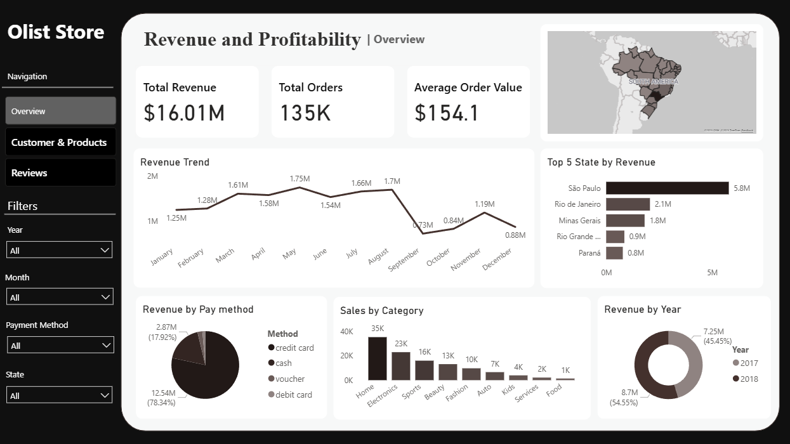
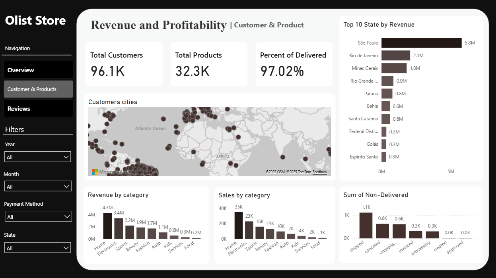
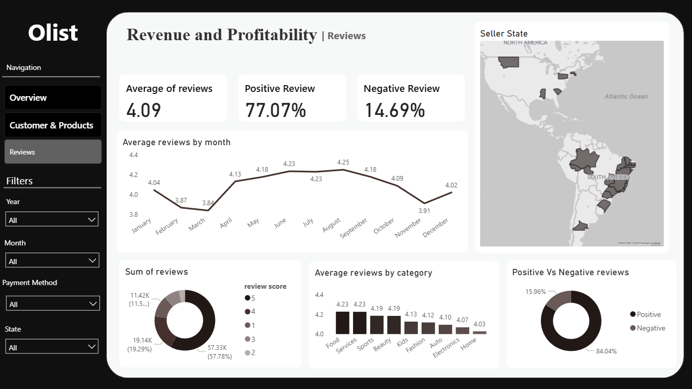

# Olist-E-Commerce-Dashboard-in-Power-BI

## 📘 Project Overview
This project presents a **comprehensive analysis** of the [Olist Brazilian E-commerce dataset](https://www.kaggle.com/datasets/olistbr/brazilian-ecommerce), resulting in a **dynamic and interactive Revenue & Profitability Dashboard** built using **Power BI**.

The main goal was to extract **actionable insights** across key business areas — including sales performance, customer behavior, geographic trends, and satisfaction — to support data-driven decision-making.

---

## 🎯 Objectives
- Analyze revenue and profitability performance.  
- Identify top-performing states, product categories, and customer segments.  
- Evaluate delivery efficiency and customer satisfaction.  
- Build a **visually engaging Power BI dashboard** integrating data from multiple sources.

---

## 📊 Key Insights
| Area | Insight Summary |
|------|-----------------|
| 💰 **Financial Performance** | $16.01M in Total Revenue across 135K Orders, with an average order value of $154.1. |
| 🗺️ **Geographic Analysis** | São Paulo leads with $5.8M in revenue; customer distribution mapped across Brazil. |
| 📦 **Products & Categories** | Top categories: Home, Electronics, and Sports — with a 97.02% delivery success rate. |
| 🌟 **Customer Satisfaction** | Average review score: 4.09/5 with 77.07% positive feedback. |

---

## ⚙️ Tools & Technologies
| Tool | Purpose |
|------|----------|
| **Power BI** | Dashboard creation, data modeling, and visualization |
| **Power Query** | Data transformation and cleaning |
| **DAX** | Advanced calculations and KPI measures |
| **Excel** | Data exploration and initial preprocessing |
| **Python (Pandas, NumPy)** | Data cleaning and preparation before integration into Power BI |

---

## 📁 Project Structure

```
Olist-Ecommerce-Analysis/
│
├── Olist_Dashboard.pbix # Power BI Dashboard file
├── Olist_Analysis_Notebook.ipynb # Python notebook for preprocessing
├── cleaned_data.csv # Processed dataset (if allowed)
├── images/ # Dashboard screenshots
│ ├── dashboard_overview.png
│ ├── revenue_insights.png
│ └── customer_analysis.png
└── README.md
```


---

## 🖼️ Dashboard Preview

### 🧾 Main Overview


### 👥 Customer & Product Insights


### 💰 Reviews Insights


---

## 🧠 Skills Demonstrated
- Data collection, preprocessing, and modeling  
- DAX calculations and measure creation  
- Data visualization and storytelling  
- Business performance analysis  
- Insight communication through interactive dashboards  

---

## 📎 Dataset
The dataset used in this project is publicly available on Kaggle:  
🔗 [Olist Brazilian E-commerce Dataset](https://www.kaggle.com/datasets/olistbr/brazilian-ecommerce)

---

## 💡 Future Enhancements
- Integration with real-time data sources via APIs  
- Addition of predictive analytics (sales forecasting)  
- Deployment of the dashboard to Power BI Service for live sharing  

---

## 👨‍💻 Author
**Joseph Adel**  
📧 [your.email@example.com]  
🔗 [GitHub Profile](https://github.com/yourusername)

---

⭐ *If you found this project helpful or inspiring, don’t forget to give it a star!*

ذذ
